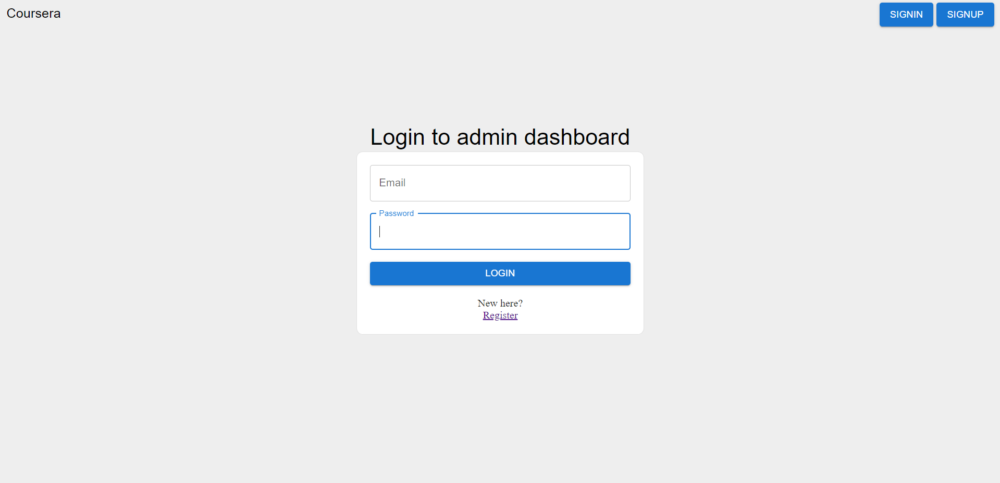
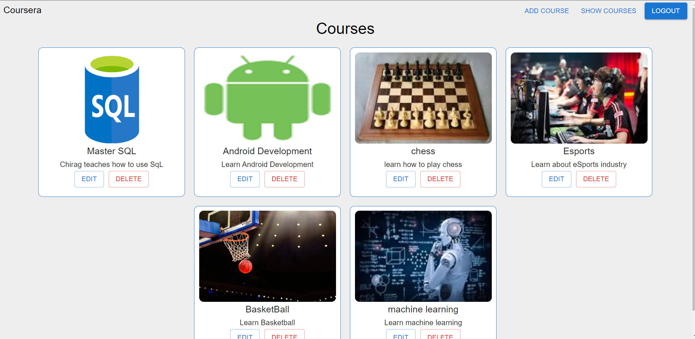
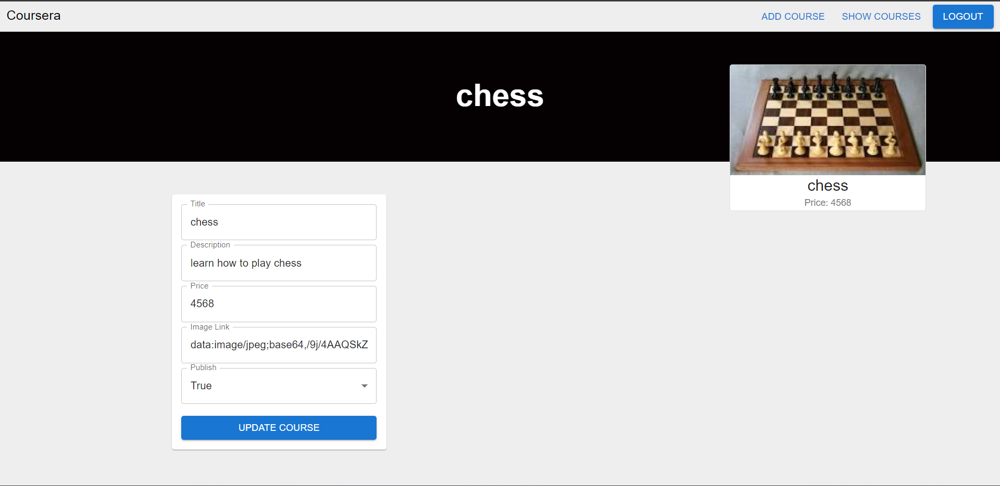
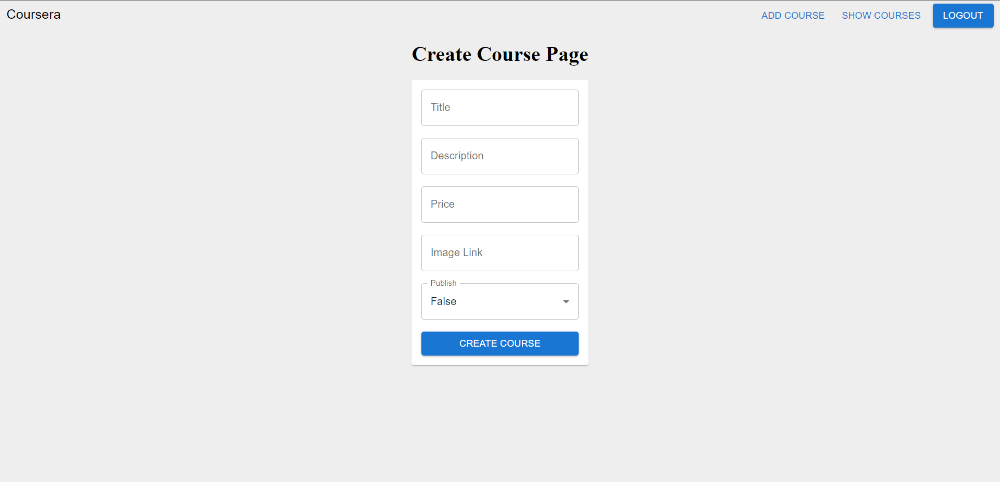
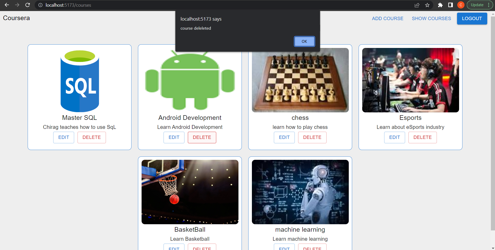
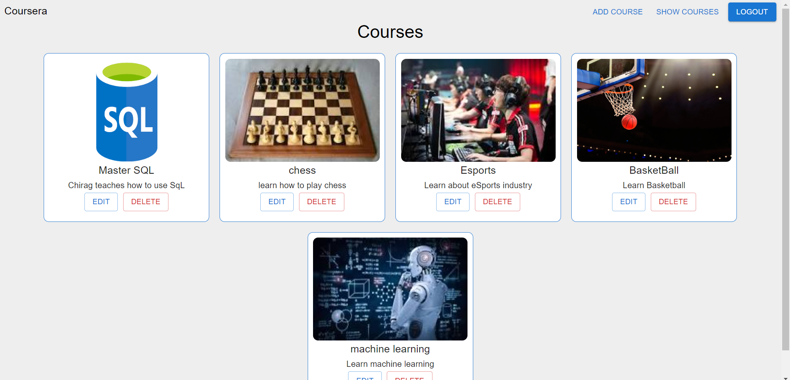

### This is the frontEnd of admin Dashboard of a course selling website

### Tech Stack used:
-Material UI
-React 
-Express
-MongoDb
-ORM used - mongoose
-State Management Library used - Recoil

### Status:
I am currently working on the admin side of things, and its a big project so i am learning on the go

### TODOS:
-To remove the hard reload on deleting a course
-Fix the stale editing data
-Convert the code base to typescript
-Add user side of the course selling website

### How to setup this project 
-Clone this repo 
-go to ./Course-selling-backend
-run npm i in your terminal under this path to download all the dependencies
-now run node index.js
-after setting up the backend , now go to /CourseSellingAdminDashboard 
-run npm i to download all the dependencies
-now run npm run dev to get the project started

### Note 
Make sure yur local mongoDb database is working and update the url to your local database in ./Course-selling-backend/index.js 
